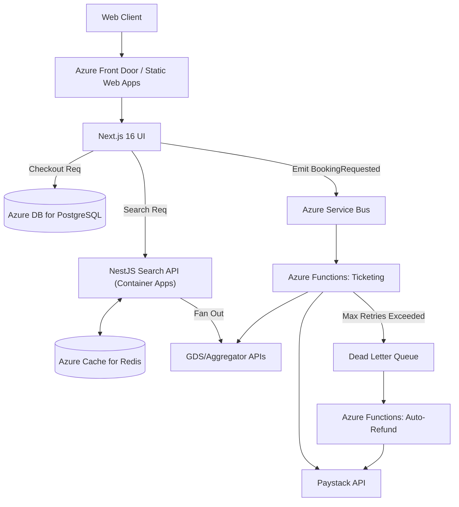
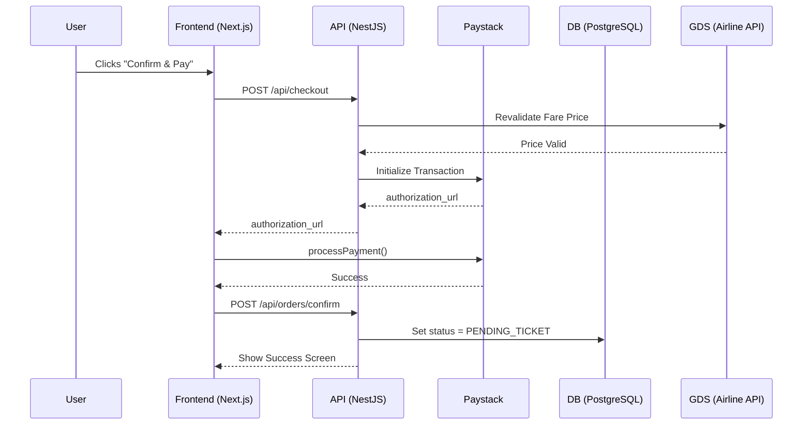
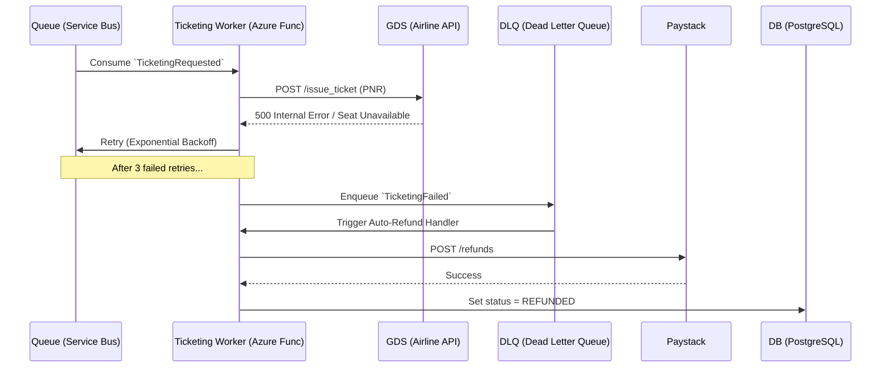
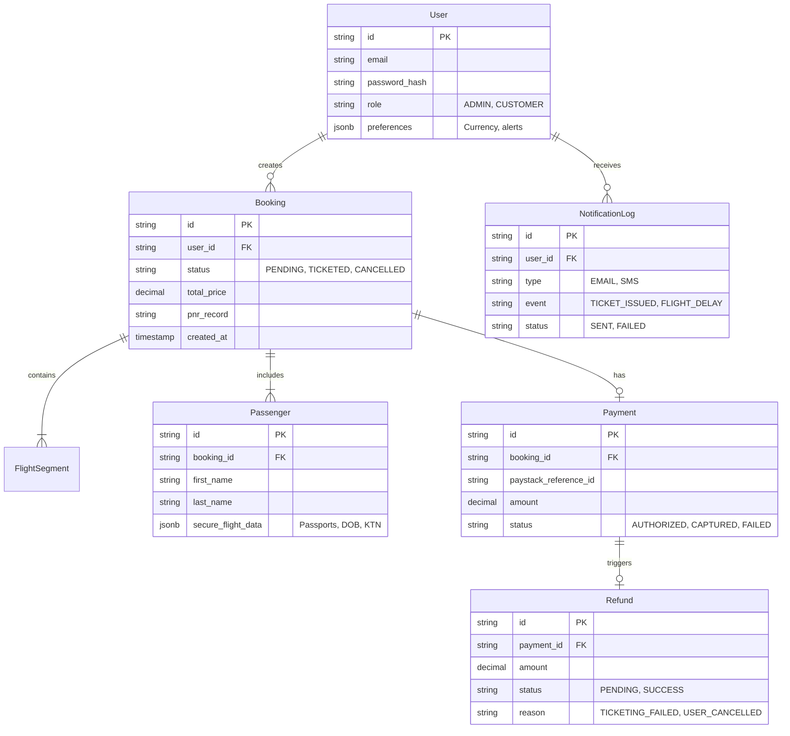

# Case Study: Master-Trip (Flight Aggregation & Booking Platform)

## Overview
**Value Proposition:** Master-Trip is a high-performance flight booking engine that normalizes and aggregates volatile inventory from legacy Global Distribution Systems (GDS) into a sub-second, highly reliable consumer booking experience.

* **GitHub Repo:** [github.com/moze/master-trip](#) *(Example)*
* **Role:** software engineer & Architecture
* **Timeline:** 2 months (part-time)

## Goals of the Project

### Business & User Goals
* Allow users to search, compare, and book international flights with zero hidden price jumps at checkout.
* Shield the business from GDS "Look-to-Book" penalty fees by heavily optimizing the search architecture.

### Technical Goals
* **Search Performance:** Achieve p95 search response times under 500ms for popular routes (despite upstream GDS latency averaging 2-5s).
* **Reliability:** Ensure 99.99% accuracy in booking state tracking to prevent stranded passengers or unauthorized chargebacks.
* **Concurrency:** Support 5,000 concurrent active search sessions without degrading the booking funnel.

### Non-Goals
* **Native Mobile App:** Deferred to v2. The MVP utilizes a responsive web app built in Next.js to minimize scope and validate the core booking engine first.
* **Hotel & Rental Car Inventory:** Explicitly excluded. Integrating flight GDS APIs (like Duffel/Amadeus) is complex enough; adding cross-vertical inventory would dilute the architectural focus.

---

## System Architecture Overview

To balance raw search performance with massive developer velocity, we implemented a **Unified TypeScript Architecture hosted entirely on Microsoft Azure**. This allows us to share complex data types (like `Flight` and `Passenger` schemas) across the entire stack via a Monorepo.

| Layer | Technology | Why This Choice | What We Considered |
| :--- | :--- | :--- | :--- |
| **Frontend** | Next.js 16 (App Router) | SSR for SEO on route landing pages; Vercel edge caching for static assets. | React SPA (poor SEO for flight routes); Remix (less ecosystem support for complex booking forms). |
| **Search Engine & API** | NestJS (Azure Container Apps) | NestJS provides enterprise-grade structure. Running it in "always-on" containers maintains persistent connection pools to GDS APIs, avoiding serverless cold starts. | Go (high performance, but breaks the unified TypeScript monorepo experience, slowing development). |
| **Async Workers** | Azure Functions (Serverless) | Perfect for bursty webhook processing (ticketing confirmation, Paystack events) and scales to zero to save costs. | Dedicated Worker VMs (unnecessary idle costs for async tasks). |
| **Database** | Azure Database for PostgreSQL | Strict ACID guarantees are mandatory for payment flows and order states. | MongoDB (lack of robust multi-document transaction support at the time of architectural design). |
| **Cache** | Azure Cache for Redis | High-speed, in-memory caching for flight search results to prevent breaching GDS rate limits. | Memcached (lacks the advanced data structures like sorted sets needed for price sorting). |
| **Event Bus** | Azure Service Bus | Decouples the fast checkout process from the slow, error-prone airline ticketing process. Provides native Dead Letter Queues (DLQ). | Direct HTTP calls (brittle; a failed ticketing call would require manual intervention). |

### Architecture Diagram (with Failure Boundaries)



---

## Core Backend Services (NestJS Modular Monolith)

To optimize developer experience on day one without sacrificing future scalability, the NestJS backend is architected as a **Modular Monolith** consisting of 7 distinct bounded contexts:

1.  **Search & Aggregation Module:** Fans out requests to multiple GDS/airline APIs simultaneously, normalizes the massive XML/JSON responses into a clean format, and caches them in Redis.
2.  **Pricing & Markup Module:** Applies dynamic business rules (e.g., adding a 5% markup to specific routes) during the search and checkout phases.
3.  **Booking Module:** The core transactional engine managing the PNR (Passenger Name Record) and the strict booking state machine (`DRAFT` -> `PENDING_TICKET` -> `CONFIRMED`).
4.  **Payment Module:** Integrates with Paystack for capturing funds, issuing holds, and initiating automated refunds via Idempotency keys.
5.  **Fulfillment & Ticketing Module (Async Worker):** Listens to Azure Service Bus. Crucial for isolating the slow, error-prone airline ticketing API calls away from the fast user checkout flow.
6.  **User & Profile Module:** Securely manages encrypted passenger details (passports, Known Traveler Numbers) in PostgreSQL.
7.  **Notification Module (Async Worker):** Triggers emails (SendGrid) and SMS (Twilio) for e-tickets, delays, and gate changes.

---

## Flows and Diagrams

### Happy Path: Payment & Ticketing Checkout


### Error Path: Ticketing Fails Post-Payment
This flow demonstrates how we handle the critical failure where a user's card is charged, but the airline rejects the final ticketing request (e.g., seat sold out concurrently). This is where the Azure Service Bus and Azure Functions shine.



---

## API and Data Design

**Key Endpoints (Bounded Contexts):**
```text
# Search (High Throughput, Cached via Redis)
GET  /api/search/flights?origin=JFK&dest=LHR&date=2026-10-12

# Booking (Transactional, Strict Auth)
POST /api/bookings                 -- Initiate PNR (Idempotency Key required)
GET  /api/bookings/:id             -- Polling endpoint for ticket status
POST /api/bookings/:id/revalidate  -- Checks if price changed before payment

# Webhooks (No Auth, Signature Verified via Azure Functions)
POST /api/webhooks/paystack          -- Handles async payment successes
POST /api/webhooks/gds             -- Handles airline delays/schedule changes
```

**Database ERD:**
We heavily normalized the core booking tables for ACID compliance, but utilized `JSONB` for the `Passenger` document metadata (passport details, KTN numbers) as airline requirements for passenger data vary wildly by country.



---

## Challenges and Solutions

| Challenge | Why It Was Hard | Solution | Trade-off |
| :--- | :--- | :--- | :--- |
| **GDS Response Latency** | Legacy airline APIs take 3-6 seconds to return search results, leading to terrible UX and UI timeouts. | Implemented Azure Cache for Redis for frequent routes and a highly-concurrent NestJS API to fan-out requests. | **Slight Price Staleness:** A user might click a cached $400 flight, only to find out during the revalidation step that it is now $420. |
| **Price Volatility at Checkout** | Between the time a user selects a flight and types in their credit card, the airline might change the price or sell the last seat. | **Optimistic Locking & Revalidation:** We force a server-side re-validation API call to the GDS the *millisecond* before the Paystack payment is captured. | Added 1.5 seconds of friction to the final checkout spinner. |
| **Silent Ticketing Failures** | The GDS would occasionally timeout during ticket issuance. The user's card was charged, but no ticket was generated. | Implemented an Azure Service Bus with a **Dead Letter Queue (DLQ)**. Failed tickets trigger an automated Paystack refund worker via Azure Functions. | Requires active monitoring of the DLQ depth via Datadog to ensure refunds aren't backing up. |

---

## Best Practices

* **Security:** 
  * Strict RBAC middleware: Users can only view their own bookings.
  * Sensitive passenger PII (passports) is encrypted at rest in PostgreSQL using `pgcrypto`.
* **Performance:** 
  * Connection pooling configured (using PgBouncer) to prevent the Serverless frontend from exhausting Azure PostgreSQL connections during high traffic spikes.
* **Developer Experience:** 
  * A 100% TypeScript Monorepo (Next.js + NestJS) to share `Flight` and `Passenger` interfaces, ensuring complex flight payloads never drift out of sync between frontend and backend.
* **Observability:** 
  * Implemented structured JSON logging with correlation IDs. A single `search_id` is passed from the Next.js frontend, through the NestJS search engine, and into the background ticketing workers to trace the entire lifecycle of a request.

---

## Conclusion

**Outcomes and Metrics:**
* Reduced p95 search latency from **4.5 seconds to 350ms** for the top 100 most popular routes via aggressive Redis caching.
* Handled simulated load tests of **5,000 concurrent users** hitting the search endpoint without dropping the booking funnel database performance.
* Eliminated manual accounting discrepancies by automating the refund flow via the Azure Service Bus Dead Letter Queue.

**Learnings: What I would do differently:**
While the NestJS Modular Monolith enabled massive developer speed on day one, if I were building this for a larger engineering team, I would eventually extract the "Ticketing Service" into a completely standalone Azure Container App. This would allow the search engine to auto-scale entirely independently from the background ticketing processes during holiday traffic spikes.

**Next Steps:**
1. Implement a WebSockets connection (via Azure Web PubSub) for the search UI to stream flight results to the client as they arrive from the GDS, rather than waiting for the slowest airline to respond before rendering the page.
2. Build an internal Admin Dashboard to manually monitor and intervene with Dead Letter Queue ticketing failures.
