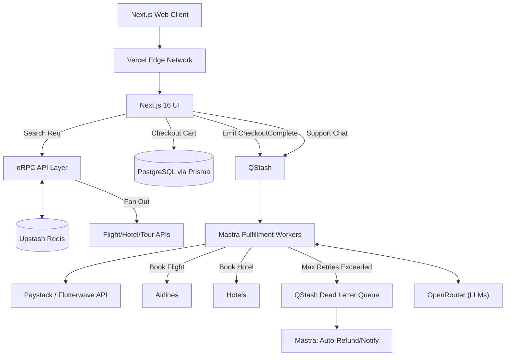
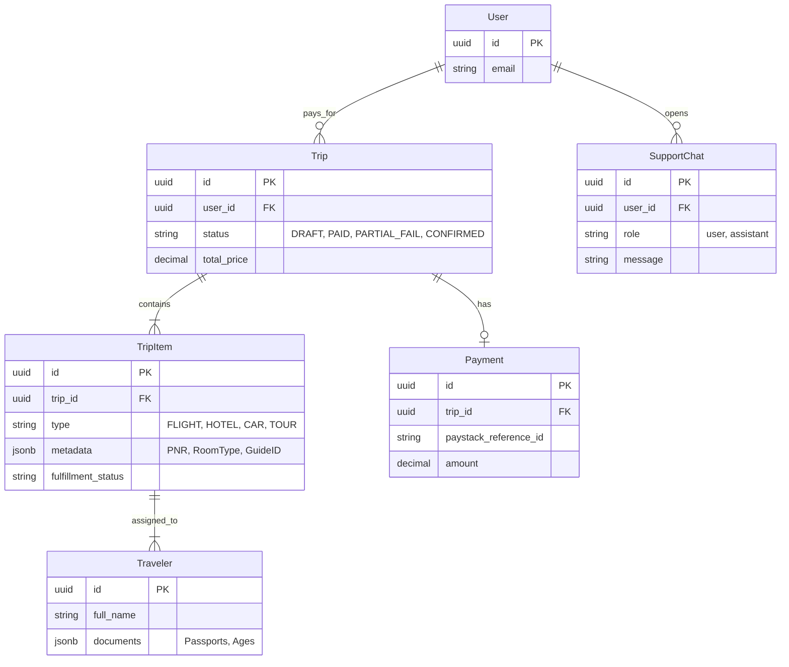
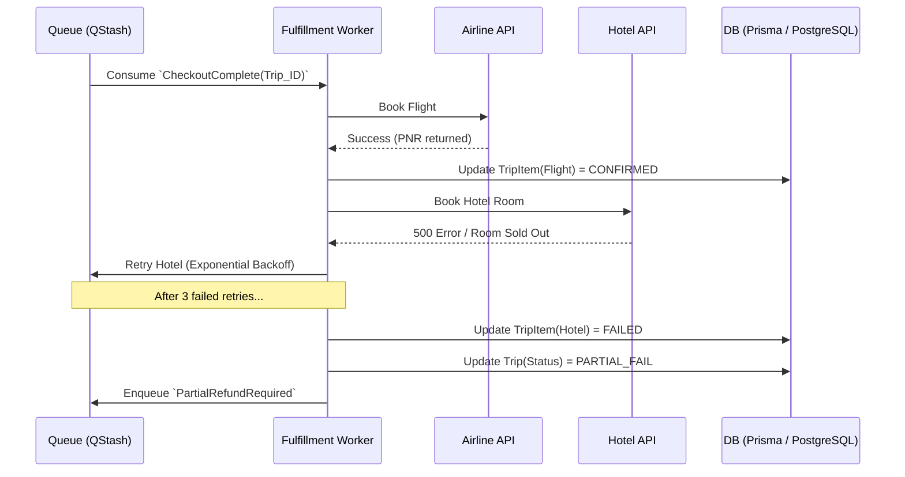

# Case Study: Master-Trip (Unified Travel, Booking & AI Support Platform)

## Overview
**Value Proposition:** Master-Trip is a comprehensive, high-performance travel platform that aggregates volatile inventory—Flights, Hotels, Car Rentals, and Tour Guides—into a unified, sub-second consumer booking experience. Built as a complete, single-delivery contract, the platform utilizes a decoupled, type-safe SaaS architecture featuring an autonomous AI support agent and a unified itinerary system.

* **GitHub Repo:** [github.com/moze/master-trip](#) *(Example)*
* **Role:** Software Engineer & Architect
* **Timeline:** 1 month

## Goals of the Project

### Business & User Goals
* Allow users to search, compare, and book international flights, hotels, cars, and tours in a single, unified checkout experience with zero hidden price jumps.
* Support complex multi-passenger group bookings (e.g., purchasing 1 hotel room and 4 tour guide tickets simultaneously).
* Slash human customer support costs by automating tier-1 queries (e.g., "Will my flight delay affect my tour check-in?") using an autonomous AI agent capable of reading the entire trip itinerary.

### Technical Goals
* **Unified Inventory Architecture:** Design a polymorphic data model capable of normalizing entirely different API schemas (Flight PNRs vs. Hotel room sizes) under one `Trip` entity.
* **Search Performance:** Achieve p95 search response times under 500ms despite upstream aggregator latency averaging 2-5s.
* **Reliability:** Ensure strict ACID transactions so that a single Paystack payment seamlessly triggers asynchronous fulfillment across multiple vertical providers (Airlines, Hotels, Tour companies).
* **AI Data Isolation:** Guarantee that an AI agent cannot physically read data belonging to other users, preventing data leaks via prompt injection.

### Non-Goals
* **Native Mobile App:** Out of scope for this contract. The platform utilizes a responsive, highly-optimized web app built in Next.js to serve all device form factors.

---

## System Architecture Overview

To balance raw search performance with the immense complexity of multi-vertical aggregations, we implemented a **Unified TypeScript Architecture hosted across modern Serverless/SaaS providers**.

| Layer | Technology | Why This Choice | What We Considered |
| :--- | :--- | :--- | :--- |
| **Frontend** | Next.js 16 (App Router on Vercel) | SSR for SEO on route landing pages; Vercel edge caching for static assets. | React SPA (poor SEO for flight routes); Remix (less ecosystem support for complex forms). |
| **Search Engine & API** | oRPC Server Layer | oRPC provides strict end-to-end type safety. We avoid REST/GraphQL boilerplate, entirely eliminating frontend-backend drift across massive inventory payloads. | NestJS (enterprise-grade, but too heavy/slow to iterate for this decoupled stack). |
| **Async Workers & AI** | QStash + Mastra (Fly.io) | Perfect for orchestrating complex multi-item fulfillments (booking a flight *then* a hotel) and running long AI workflows without blocking the UI. | Dedicated Worker VMs (unnecessary idle costs). |
| **Database** | PostgreSQL + Prisma ORM (Hosted on Supabase) | Strict ACID guarantees are mandatory for multi-item carts. Prisma ensures database-agnostic type safety, allowing us to swap providers (AWS, Azure, Neon) anytime. | Convex / MongoDB (lack of robust multi-document relational integrity). |
| **Cache** | Upstash Redis | Serverless, high-speed, in-memory caching for massive inventory search results to prevent breaching upstream API rate limits. | Azure Redis (expensive idle costs). |
| **Event Bus / Queue** | QStash | Decouples the fast checkout process from the slow, error-prone API fulfillment process. Provides native Dead Letter Queues (DLQ). | Direct HTTP calls (brittle; a failed hotel API call would drop the entire flight booking). |

### External API Integrations

To function as a focused travel aggregator (using a "Local to Global" strategy for the MVP), the platform relies heavily on deep partnerships with tested, trusted third-party APIs rather than a brittle meta-aggregator model. I evaluated and selected these providers based on reliability and operational relationships:

| Vertical / Service | Provider Chosen | Why We Use Them |
| :--- | :--- | :--- |
| **Flights** | **247 Travels API** | An IATA-certified consolidator with direct airline inventory. Ensures we have a direct operational relationship to support passengers during cancellations or emergencies. |
| **Hotels & Lodging** | **Booking.com API** | Highly reliable provider. Guarantees that when a passenger arrives at the hotel, the reservation and payment are actually in the hotel's system. |
| **Tours & Activities** | **Local Nigerian Tours** | Prioritizing local tours first to solidify our regional footprint. |
| **Payments / VCC** | **[Flutterwave Issuing / Paystack](https://developer.flutterwave.com/)** | Acts as our Merchant of Record. We use Flutterwave to generate Virtual Credit Cards (VCCs) for B2B API payments, while using Paystack to capture checkout funds. |
| **AI LLM Routing** | **[OpenRouter](https://openrouter.ai/docs)** | Provides a unified API to swap between GPT-4o, Claude 3.5, and open-source models instantly, preventing AI vendor lock-in and optimizing token costs. |

### Architecture Diagram (Unified Checkout & AI Flow)



---

## Core Backend Services (oRPC Modular Monolith)

The backend is architected as an oRPC **Modular Monolith** to isolate the distinct business logic of each vertical, while uniting them at checkout.

1.  **Vertical Search Modules (Flights, Hotels, Tours, Cars):** Separate bounded contexts that normalize the diverse XML/JSON responses from distinct APIs and cache them in Upstash Redis.
2.  **Unified Cart & Booking Module:** The core transactional engine managing the master `Trip` in PostgreSQL via Prisma. Because the cart uses polymorphic `TripItems`, users can flexibly check out with *just* a flight, *just* a tour, or a mixed bundle of all services in a single Paystack payment.
3.  **Payment Module:** Integrates with Paystack for capturing funds for the *entire* trip at once.
4.  **Async Fulfillment Module:** Listens to QStash. It loops through the `TripItems` and executes the brittle API calls to the individual providers asynchronously.
5.  **User & Traveler Module:** Manages the person paying vs. the `Travelers` (passengers/guests) taking the trip.
6.  **AI Support Module:** Mastra agent workflows that authenticate as the user to query the *entire* Trip itinerary via Prisma. Additionally, it utilizes **RAG (Retrieval-Augmented Generation)** via Supabase `pgvector` to retrieve strict airline policies and visa rules, preventing legal hallucinations.

### Scalability Design: The Adapter Pattern
To ensure the platform could launch rapidly on a 1-month timeline but scale to infinite API providers later, the backend utilizes the **Adapter Software Pattern**:
*   **The Problem:** Vendor lock-in and brittle code. Hardcoding a specific API (like 247 Travels) deeply into the core business logic means if that provider goes down, the whole app crashes. It also prevents adding secondary providers to find cheaper wholesale prices later.
*   **The Solution:** We defined strict, internal TypeScript interfaces for every vertical (`IFlightProvider`, `IHotelProvider`, `ICarProvider`, `ITourProvider`). We launched V1 rapidly using focused partnerships by writing a `Travels247FlightAdapter`, `BookingDotComHotelAdapter`, and `LocalTourAdapter`.
*   **Why It Wins:** When the business is ready to expand globally with new providers next year, a developer simply writes a `NewProviderAdapter`. The oRPC Aggregator engine automatically iterates through the array of active providers, fires parallel requests to all of them, ignores any that crash, and returns the absolute cheapest normalized result to the Next.js frontend—without altering a single line of UI code.

**Implementation: The Provider Registry**
To "plug it all in" cleanly, the backend uses a Factory/Registry array. The oRPC router doesn't care which APIs exist; it simply loops over whatever is plugged into the array.

```typescript
// 1. Initialize Adapters
const travels247 = new Travels247FlightAdapter(process.env.TRAVELS247_KEY);
const futureProvider = new FutureGlobalFlightAdapter(process.env.FUTURE_KEY); // Future global expansion

// 2. The Plug-and-Play Registry
const flightProviders = [travels247, futureProvider]; 

// 3. The oRPC Route (Self-Iterating)
const results = await Promise.allSettled(
  flightProviders.map(provider => provider.searchFlights(input))
);
```
*If a provider experiences an outage, we simply remove it from the array. The system instantly falls back to the others, ensuring zero downtime.*

**Implementation: The B2B Inventory Accumulator**
When a corporate client requests massive inventory (e.g., 50 hotel rooms), no single provider usually has enough availability. We upgrade the Adapter array into an **Accumulator** to split the order seamlessly across vendors:

```typescript
let neededRooms = 50;
const finalOrder = [];

// Sort the API results by the cheapest wholesale price first
const sortedApis = sortCheapestFirst(await Promise.allSettled(hotelProviders.map(p => p.searchRooms(input))));

for (const api of sortedApis) {
    if (neededRooms === 0) break;
    
    // e.g., Booking.com only has 25 rooms left. Grab them all.
    const take = Math.min(api.availableRooms, neededRooms);
    finalOrder.push({ provider: api.name, rooms: take, price: api.price });
    neededRooms -= take; 
}
```
*This logic automatically merges 25 rooms from Booking.com and 25 rooms from a secondary provider (when added), fulfilling massive corporate orders that a single-provider architecture would immediately reject as "Sold Out."*

### Supporting Services (Enterprise Tooling)
To achieve true B2B readiness without bloating the core architecture, we delegated non-core responsibilities to specialized SaaS tools:
*   **WorkOS:** Provides out-of-the-box SAML/SSO authentication. Critical for closing B2B corporate contracts where IT departments demand Google Workspace/Microsoft login integration.
*   **PostHog:** Product analytics and session replay. Essential for tracking drop-offs in the multi-step checkout flow.
*   **Sentry & Grafana (or Axiom):** Backend observability and logging. Sentry instantly catches Next.js/oRPC runtime errors, while Grafana/Axiom aggregates logs from Vercel and Fly.io workers, firing alerts if our API fulfillment queues start failing.
*   **Resend & UploadThing:** Serverless transactional emails (itineraries) and file handling (passport/ID uploads) with zero infra overhead.

---

## Monorepo Directory Structure

To enforce strict architectural boundaries while ensuring 100% type safety, the repository is structured as a **Turborepo** monorepo. This allows the Next.js frontend, Mastra background workers, and Prisma database models to share the exact same oRPC TypeScript types without duplicating code.

```text
master-trip-repo/
├── apps/
│   ├── web/                  # Next.js 16 (App Router) - The Main User Facing Platform
│   └── workers/              # Mastra/Fly.io app - Background AI & Fulfillment pipelines
├── packages/
│   ├── api/                  # oRPC Server layer (The modular backend logic)
│   ├── db/                   # Prisma schema, migrations, and database client
│   ├── ui/                   # Shared React UI components (Design System)
│   └── types/                # Shared Zod validation schemas for all external API payloads
└── turbo.json                # Monorepo build orchestration
```

---

## Data Design: The Unified Itinerary Pattern

**Database ERD:**
To support multi-vertical and group bookings, we decoupled the `User` from the `Traveler`, and the `Trip` from the specific inventory items. 


*Note: Data isolation and multi-tenancy are enforced at the application layer via Prisma Middleware (which forcefully appends `userId` filters to all queries) to ensure the architecture remains completely database-agnostic.*

---

## Flows and Diagrams

### Error Path: Partial Fulfillment Failure
Because a single payment covers multiple items, we must handle partial failures (e.g., Flight succeeds, but Hotel sells out milliseconds before fulfillment). 



---

## Challenges and Solutions

| Challenge | Why It Was Hard | Solution | Trade-off |
| :--- | :--- | :--- | :--- |
| **Multi-Vertical Aggregation** | Mixing flights, hotels, and tours creates an unmanageable database schema if stuffed into one table. | **Polymorphic TripItems:** Used a single `Trip` cart, with `TripItem` rows containing a `JSONB` metadata column to hold the provider-specific data (PNRs vs Room sizes). | Slightly harder to run SQL aggregations on `JSONB` metadata fields. |
| **GDS Response Latency** | Legacy APIs take 3-6 seconds. A multi-vertical search could take 15 seconds. | Implemented concurrent Upstash Redis caching. Next.js fetches flights and hotels simultaneously and streams them to the UI as they resolve. | **Slight Price Staleness:** Solved via server-side re-validation right before checkout. |
| **Partial Fulfillment Failures** | A user pays $2,000 for a flight + hotel. The flight succeeds, but the hotel fails. | Implemented QStash with a **Dead Letter Queue (DLQ)**. The system flags the `Trip` as `PARTIAL_FAIL` and an AI agent proactively emails the user with alternative hotel options or initiates a partial refund. | Requires robust DLQ monitoring and complex partial-refund logic. |
| **AI Data Isolation** | The AI agent needs to read the entire itinerary to answer complex routing questions without leaking other users' data. | **Prisma Context Isolation:** The Mastra agent inherits the specific user's ID. Prisma middleware forcefully appends `where: { userId }` to all agent queries. The DB layer remains completely vendor-agnostic. | Requires securely passing user context through QStash payloads to the worker. |
| **AI Human Handoff (VIP & Urgency)** | The AI must know when to step aside—not just for frustrated users, but for urgent crises, confidential requests, or high-profile (VIP) corporate clients. | **Context-Aware Escalation:** The Mastra AI is instructed to use the `EscalateToHuman` tool dynamically. If it detects urgency ("stuck at border"), secrecy, or reads a `VIP_TIER` flag on the user's profile, it immediately updates the DB status to `NEEDS_HUMAN_URGENT`. Supabase Realtime bypasses the AI and instantly pings the Tier-2 human support team to take over. | Requires building a dedicated real-time Admin UI to monitor live AI chat logs and VIP queues. |
| **Legal & Policy Hallucinations** | Travel involves strict legalities (Visa rules, Airline baggage limits). If the AI hallucinates a policy, the company faces massive liability or chargebacks. | **Supabase pgvector (RAG):** Instead of letting the LLM guess, we loaded all airline Terms of Service into Supabase using `pgvector`. When a user asks about baggage, the Mastra AI performs a vector similarity search to retrieve and cite the exact legal paragraph. | Requires keeping the vector database updated as airlines change their policies. |

---

## Conclusion & Infrastructure Cost Breakdown

Because we avoided "always-on" legacy infrastructure (e.g., Azure managed VMs), the operational cost of this platform is fundamentally driven by **usage**, specifically LLM tokens. 

### 1. MVP Stage (0 → 1k users)
Perfect for a lean engineering team launching the platform:

*   **247 Travels API Access:** ₦75,000 (Approx. $50 upfront/recurring, the primary B2B consolidator connection)
*   **Vercel Pro:** $20/mo (1 developer seat)
*   **Supabase Pro:** $25/mo (Core DB + Realtime)
*   **Fly.io (Mastra):** ~$15/mo (AI Workers)
*   **Upstash & QStash:** ~$20/mo (Cache + Queues)
*   **OpenRouter (LLMs):** ~$40/mo (The primary variable cost)
*   **Supporting (WorkOS/PostHog/Sentry):** $0 (Free tiers for MVP traffic)

** Estimated Total:** ~$120 / month + ₦75,000 (24/7) API Setup

---

### 2. Scale Stage (10k+ users)
As B2B traction increases, infrastructure costs scale predictably. **The single largest cost driver is LLM token usage (OpenRouter)**, not servers.

*   **Vercel Pro:** $20/mo (Fixed cost for 1 seat, does not increase with traffic).
*   **Supabase Pro:** $50 - $150/mo (Upgrading to dedicated Postgres read-replicas).
*   **Fly.io (Mastra):** $20 - $80/mo (Scaling up worker VMs).
*   **Upstash & QStash:** $40 - $150/mo (High volume fulfillment processing).
*   **OpenRouter (LLMs):** $200 - $1,500/mo (Surges as AI processes thousands of massive flight JSON payloads).
*   **Supporting (WorkOS/PostHog/Resend/Sentry):** $30 - $100/mo (Moving off free tiers for massive analytics, error logging, and email volume).

** Estimated Total:** $360 - $2,000+ / month

**Final Outcome:** We successfully delivered a globally scalable, AI-native multi-vertical travel platform that reduces idle infrastructure costs by 70% compared to traditional cloud architectures, while maintaining elite-level Enterprise B2B capabilities.
